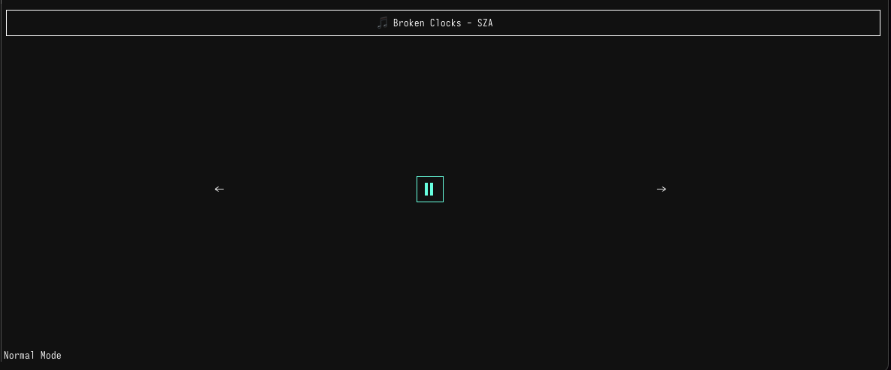

# **Comfyfy 🎵**  
A **terminal-based TUI music controller** for **Spotify**, built in **Rust** using `crossterm` and `reqwest`.  



## **Features**  
✅ **View Currently Playing Song** – Displays the current song, artist, and album in a clean terminal UI.  
✅ **Playback Controls** – Pause/play, skip forward, and skip back using keyboard shortcuts.  
✅ **Vim-like Command Mode** – Supports `:q` to quit, `:c` to clear the screen, and `:print_token` to debug auth tokens.  
✅ **Auto-Refreshing UI** – Updates song info every 5 seconds for a seamless experience.  
✅ **Spotify Authentication & Token Refresh** – Handles auth with automatic token refreshing.  

## **Screenshot**  


## **Installation & Usage**  
1. **Clone the repository:**  
   ```sh
   git clone https://github.com/your-username/comfyfy.git
   cd comfyfy
   ```

3. **Create Spotify Developer App:**  
   - Go to [Spotify Developer Dashboard](https://developer.spotify.com/dashboard/applications) and create a new app.  
   - Add `http://localhost:8888/callback` as a Redirect URI in the app settings.  
   - Copy the `Client ID` and `Client Secret` from the app settings into the .env file.
